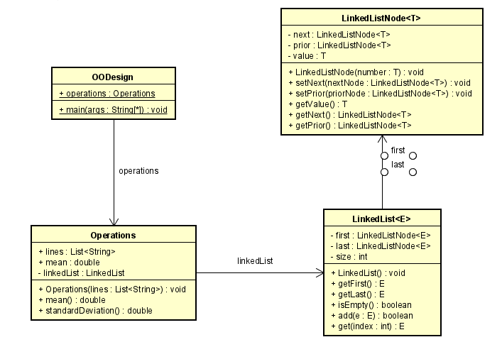
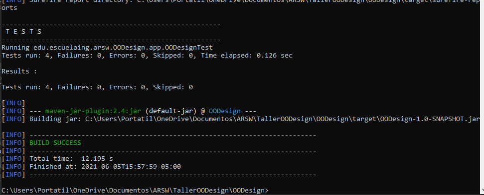

# OODesign
### Daniel Santiago Ducuara Ardila
### 05/06/2021

## Diagrama de clases
 
El objetivo del proyecto es realizar una lista enlazada basada en el api de java, una vez realizada esta lista
se debe leer como entrada una columna de números en un archivo e ir ingresando estos datos en la lista enlazada.
Una vez se ingresen todos los datos se procede a realizar dos operaciones, obtener la media y la desviación estándar
del conjunto de datos del archivo.
La clase OODesign es quien recibe el archivo y llama a la clase operations para realizar los cálculos de media y desviación
estándar, la clase Operation recibe el archivo y transfiere los datos a la lista enlazada mediante el atributo linkedList y el
método add. Posteriormente se encuentran los métodos que calculan la media y desviación estandar que retornan un dato tipo double
redondeado a dos decimales. La clase LinkedList<E> es la clase de la lista enlazada en la que tiene dos atributos nodos de tipo
LinkedListNode, first es el nodo cabeza de la lista y last el último, posteriormente se agregan los métodos básicos para el
funcionamiento de la lista como agregar nodos o obtener nodos. Por último la clase LinkedListNode es la clase que guarda la información 
de cada nodo y se tienen métodos para retornar su información o cambiar valores de sus atributos.

## Reporte de pruebas
 
Se realiza el reporte de pruebas con todas las pruebas satisfactorias, se adjunta en el archivo tres archivos de prueba.
**Para la ejecución de pruebas es necesario cambiar la ruta del archivo.** 

### Productividad
La productividad de este proyecto fue de 347LOC/10h .